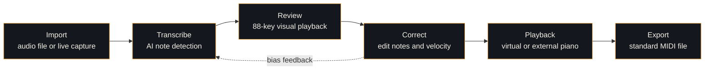
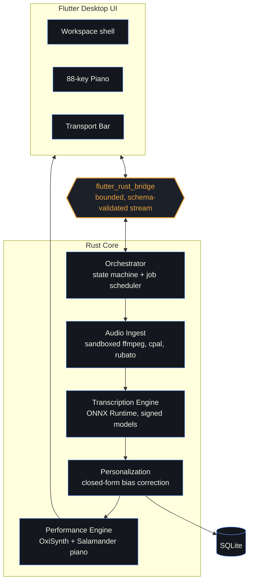

<div align="center">


<sub>Proposed product identity for this repository · technical package name <code>ai_player</code> retained below</sub>

<br/><br/>

[](https://github.com/MuzammilCk/ai_player/actions/workflows/ci.yml)
[](https://github.com/MuzammilCk/ai_player/actions/workflows/security.yml)


</div>

<br/>

> [!NOTE]
> **On the name.** This document proposes **Clavion** — from *clavier*, the historical term for keyboard instruments — as the product identity for the app currently developed under the repository name `ai_player`. Source paths, the Rust crate (`rust_lib_ai_player`), and the Flutter package name are left untouched; renaming those is a separate, mechanical refactor, not a documentation change. See [Why "Clavion"](#why-the-name-clavion) for the reasoning.

## Contents

- [Overview](#overview)
- [See It In Action](#see-it-in-action)
- [Why Clavion](#why-clavion)
- [How It Works](#how-it-works)
- [Architecture](#architecture)
- [Tech Stack](#tech-stack)
- [Validated Performance](#validated-performance)
- [Roadmap](#roadmap)
- [Security and Compliance](#security-and-compliance)
- [Getting Started](#getting-started)
- [Project Structure](#project-structure)
- [Contributing](#contributing)
- [Why the Name, "Clavion"](#why-the-name-clavion)
- [Acknowledgments](#acknowledgments)
- [License](#license)

---

## Overview

Clavion turns a piano performance into an editable score. Drop in a recording, or play live, and the app listens using pretrained AI models, shows every detected note on an animated 88-key keyboard, lets you correct what the model missed, plays your performance back through a sampled grand piano, and exports clean, pedal-accurate MIDI.

It's built **local-first**: transcription, correction, and playback all run on-device. No audio, no notes, and no personal data have to leave the machine it's installed on.

```
Import  →  Transcribe  →  Review  →  Correct  →  Playback  →  Export
```

## See It In Action

<table>
<tr>
<td width="50%">

<p align="center"><sub><b>Projects</b> — launch, resume, or start a new transcription project</sub></p>
</td>
<td width="50%">

<p align="center"><sub><b>Import</b> — bring in an audio file and track transcription progress</sub></p>
</td>
</tr>
<tr>
<td width="50%">

<p align="center"><sub><b>Review &amp; Playback</b> — the 88-key workstation, note review, and transport</sub></p>
</td>
<td width="50%">

<p align="center"><sub><b>Settings</b> — audio device, model tier, and diagnostics</sub></p>
</td>
</tr>
</table>

<sub>Screenshots are golden-tested in CI (`docs/test-log.md`, 2026-06-27) — what you see above is what the app actually renders, not a mockup.</sub>

## Why Clavion

- **Two-tier transcription.** A fast, Apache-2.0 model (Spotify's `basic-pitch`, split into `features_model.onnx` + `cnn_model.onnx` for native Rust inference) for quick turnaround, and a higher-accuracy Pro-tier model (ByteDance `piano_transcription_inference`) for critical takes.
- **Self-correcting, not retrained.** A closed-form personalization layer learns your pitch, timing, and velocity tendencies from your corrections. No retraining, no network calls, no data leaves the device.
- **Real performance data, not just notes.** Captures velocity and sustain-pedal (MIDI CC64) — "the right notes" and "it sounded like the performance" are different claims, and Clavion targets the second one.
- **Security posture from day one, not bolted on later.** Sandboxed audio decoding, Ed25519-signed model manifests verified before any model loads, and a blocking three-tool supply-chain scan on every push.
- **Built to be audited.** Every milestone closes against CI-checkable exit criteria and an append-only architecture decision log — not a changelog written after the fact.

## How It Works



Corrections you make in the review step feed the personalization layer, which quietly recalibrates future transcriptions to how you actually play — sharper attack timing, consistent voicing, your instrument's quirks.

## Architecture



A cross-cutting security, compliance, and observability layer (threat model, secrets handling, supply-chain scanning, telemetry scrubbing, accessibility conformance) spans every layer above rather than living in one module — see `architecture.md` §12 for the full treatment.

## Tech Stack

| Layer | Technology |
|---|---|
| UI | Flutter (desktop) |
| Bridge | `flutter_rust_bridge` 2.12, typed and bounded |
| Orchestration | Rust + `tokio` |
| Audio decode | FFmpeg, sandboxed subprocess (no network, memory/time ceiling) |
| Resampling | `rubato` |
| Audio I/O | `cpal` |
| AI inference | ONNX Runtime via the `ort` crate, op-allowlisted sessions |
| MIDI | `midly` (file export) / `midir` (live external output) |
| Synthesis | OxiSynth / RustySynth + Salamander Grand Piano samples |
| Persistence | SQLite via `rusqlite` |
| State management | Riverpod + Freezed |
| CI / CD | GitHub Actions, `cargo-audit`, `cargo-deny`, `pip-audit` |

## Validated Performance

Milestones close against measured numbers, not a subjective "looks done." A few current ones, from `docs/test-log.md`:

| Check | Result | Threshold |
|---|---|---|
| `basic-pitch` transcription, 20-file evaluation set | Onset-F1 **0.836** | ≥ 0.80 |
| Flutter widget, accessibility &amp; golden tests (latest run) | **29 / 29** passing | — |
| Windows integration smoke tests | **3 / 3** passing | — |
| Rust unit + integration suite | passing | — |
| Screenshot-golden UI validation | passing | — |

## Roadmap

Build order and exit criteria are defined in `architecture.md` §15; status below mirrors `docs/build.md`.

| Milestone | Scope | Status |
|---|---|---|
| 0 — Go/No-Go Spikes | ONNX split validation, Transkun feasibility, subprocess sandbox | ✅ Closed |
| 1 — Skeleton | Flutter shell, `flutter_rust_bridge`, SQLite | ✅ Closed |
| 2 — Fast/Import MVP | Import → Transcribe → read-only Review → Playback → Export, project-first UI | ✅ Closed |
| 3 — Correction Editor + Personalization | Note editing, undo/redo, bias-correction backend | ⏳ Not started |
| 4 — Near-Real-Time Listen Mode | Live capture, streaming inference, key animation | ⏳ Not started |
| 5 — Pro Mode | ByteDance model, pedal logic, humanization | ⏳ Not started |
| 6 — Security &amp; Hardening | Threat model, signed updates, telemetry scrubbing | ⏳ Not started |
| 7 — Enterprise Readiness | Managed deployment, VPAT, SLA docs | ⏳ Not started |

> [!IMPORTANT]
> Transkun was evaluated as a second Pro-tier model and rejected (Milestone 0b, NO-GO): its CRF/Viterbi decoder can't be traced through `torch.onnx.export`. ByteDance is the sole Pro-tier model going forward — a real example of the decision log doing its job.

## Security and Compliance

Shipped today:
- **Signed model manifests** — every ONNX model is Ed25519-signature-verified before it loads.
- **Sandboxed audio decoding** — FFmpeg runs as an argument-vector subprocess (never shell-interpolated) with no network access and a bounded memory/wall-clock ceiling.
- **Blocking supply-chain scan** — `cargo-audit`, `cargo-deny` (license + advisory + ban-list), and `pip-audit` run on every push.
- **Accessibility enforced in CI** — automated contrast and labeled-tap-target checks (a real regression was caught and fixed on 2026-06-27).

On the roadmap (Milestone 6–7):
- Signed SBOM generation on every release build.
- Published VPAT against EN 301 549 / Section 508.
- Managed-deployment policy layer (MDM-compatible silent install, org-wide defaults).

## Getting Started

### Prerequisites

- **Flutter SDK**, Dart `^3.12.2` — [flutter.dev](https://flutter.dev)
- **Rust**, stable channel, `x86_64-pc-windows-msvc` target, via [rustup](https://rustup.rs)
- **Visual Studio C++ Build Tools** (Desktop development with C++ workload)
- `flutter_rust_bridge_codegen`:
  ```bash
  cargo install flutter_rust_bridge_codegen --version 2.12.0
  ```

### Build and run

```bash
git clone https://github.com/MuzammilCk/ai_player.git
cd ai_player

flutter pub get
flutter_rust_bridge_codegen generate
dart run build_runner build -d

flutter run
```

> [!IMPORTANT]
> Clavion is currently scoped and CI-tested for **Windows only** (v1 scope ADR, 2026-06-25). macOS/Linux sandbox code is retained in the tree for future re-enablement but isn't part of the supported build today.

## Project Structure

```
ai_player/
├── lib/                      # Flutter UI (Dart)
│   └── src/
│       ├── pages/             # Projects, Settings, Workspace (Import / Listen / Review)
│       ├── providers/         # Riverpod state
│       ├── theme/             # Design tokens (app_theme.dart)
│       ├── widgets/           # Piano keyboard, transport bar, error banner, context menu
│       └── rust/               # Generated flutter_rust_bridge bindings
├── rust/                      # Rust core
│   └── src/
│       ├── api/                 # Bridge-exposed surface
│       └── pipeline/            # audio · inference · live · playback · signature
├── spikes/                    # Milestone 0 go/no-go research spikes
├── onnx_models/                # Signed model artifacts
├── docs/                      # Living project memory
│   ├── context.md               # Current milestone status and next actions
│   ├── decisions.md             # Architecture decision records
│   ├── known-issues.md          # Open bugs, blockers, accepted limitations
│   └── test-log.md              # Model regression and test results
├── architecture.md             # Full system architecture (v4)
├── ui-ux-architecture.md       # Frontend component contract
└── setup.md                    # Local dev environment setup
```

## Contributing

This repo runs on append-only living documents instead of tribal knowledge. Before starting work, read the relevant one; when you finish, append to it — never rewrite history:

- `docs/context.md` — what's done, what's next
- `docs/decisions.md` — why a call was made, and what was rejected
- `docs/known-issues.md` — open bugs and accepted limitations
- `docs/test-log.md` — model regression results

A milestone isn't closeable on vibes: it's gated by the CI-checkable exit criteria in `architecture.md` §15, cross-referenced against the component list in `ui-ux-architecture.md`. Milestone 3 (correction editor + personalization) is the next one open for work.

## Why the Name, "Clavion"

`ai_player` describes what the repository does today; it doesn't say what the product is. A few reasons for the alternative:

- **Rooted, not generic.** *Clavier* is the historical term for keyboard instruments — the root of "keyboard" itself in French and German. "Clavion" reads as a keyboard-instrument product without being a literal, hard-to-trademark dictionary phrase like "Piano Transcriber."
- **Says nothing false.** It doesn't promise "AI" as a prefix gimmick, and it doesn't overclaim real-time performance the current architecture doesn't deliver (see the Near-Real-Time Listen Mode framing in `architecture.md` §6).
- **Wordmark-ready.** Short, phonetic, and works as a domain, a package identifier, and next to a logotype.

This is a naming suggestion, not a clearance search — before adopting it, run an actual trademark check (USPTO TESS or your local registry) and confirm the domain and package-registry names you want are free.

## Acknowledgments

Clavion is built on and evaluated against real open-source and public-domain work:

- [`basic-pitch`](https://github.com/spotify/basic-pitch) (Spotify) — Fast-tier transcription model
- [`piano_transcription_inference`](https://github.com/qiuqiangkong/piano_transcription_inference) (Kong et al., ByteDance research) — Pro-tier transcription model
- [NeuralNote](https://github.com/DamRsn/NeuralNote) — reference architecture for the ONNX split boundary (pattern reused, no code imported)
- [Transkun](https://github.com/Yujia-Yan/Transkun) — evaluated for a second Pro-tier model; excluded after Milestone 0b (see [Roadmap](#roadmap))
- Salamander Grand Piano — public-domain piano samples
- ONNX Runtime, OxiSynth / RustySynth, Flutter, and the Rust crate ecosystem this is built on

## License

> [!WARNING]
> No `LICENSE` file is currently published in this repository. Until one is added, default copyright applies and no reuse rights are granted to others. Each bundled third-party component carries its own license — see the Component Register in `architecture.md` §1 — but the license for this project's own source is a decision still to be made and recorded here.

---

<div align="center">


<sub>Built on Flutter, Rust, and ONNX Runtime</sub>

</div>
