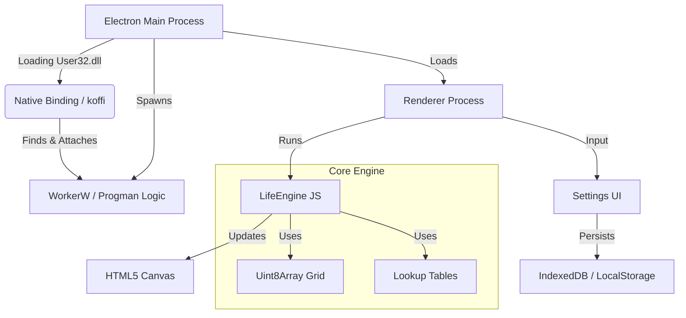

# LifeDesk

A GPU-accelerated, interactive Game of Life desktop wallpaper for Windows.

## Features
- **Real Wallpaper**: Runs behind desktop icons using native Windows APIs.
- **High Performance**: Optimized `Uint8Array` engine + Canvas/WebGL rendering. 
- **Interactive**: Draw cells with your mouse directly on the desktop.
- **Customizable**: Change rules (Conway, HighLife, Seeds), speed, and colors.
- **Persistence**: Saves your state and settings automatically.

## Controls
- **Space**: Pause/Resume
- **R**: Reset/Randomize
- **S**: Save State (Snapshot)
- **H**: Toggle Settings UI
- **Mouse Drag**: Draw cells

## Architecture

- **Engine**: Decoupled JS class using typed arrays and lookup tables.
- **Renderer**: HTML5 Canvas with optimized batch drawing.
- **Native**: Uses `koffi` to interface with `User32.dll` to find `WorkerW` and `SetParent` logic.

## Build
```bash
npm install
npm start # Dev
npm run dist # Build installer
```
