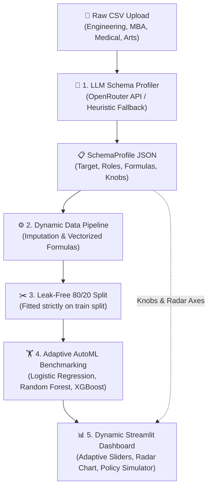

# 🎓 PlacementPulse AI: Adaptive Multi-Domain Student Placement Prediction & Cohort Simulator

[](https://www.python.org/downloads/)
[](https://streamlit.io/)
[](https://scikit-learn.org/)
[](https://xgboost.readthedocs.io/)
[](https://openrouter.ai/)
[]()

**PlacementPulse AI** is a production-grade, schema-agnostic placement classification engine, diagnostic radar, and macro policy simulator. By pairing **OpenRouter LLM semantic profiling** with a **deterministic Python AutoML runtime**, the system dynamically adapts to any college placement dataset (Computer Science & Engineering, MBA / Management, Allied Healthcare, Arts & Sciences) without manual schema adjustments or hardcoded feature dependencies.

---

## 🌟 Key Highlights & Capabilities

- **🧠 Schema-Agnostic LLM Semantic Profiling**: Accepts arbitrary tabular datasets; calls OpenRouter LLMs once per upload (~500 tokens, <2s) to discover target variables, classify feature roles, and synthesize domain-specific composite formulas (e.g., Coding Readiness for CS, Aptitude Index for MBA).
- **🛡️ Deterministic High-Performance Python AutoML**: Heavy computation, leak-free preprocessing (`ColumnTransformer`), 5-Fold Stratified Cross-Validation, and model benchmarking (Logistic Regression, Random Forest, XGBoost) remain strictly in deterministic Python.
- **🎯 Per-Student Diagnostic & Remediation Engine**: Quantifies deficit attribution and projects calibrated probability uplifts for specific student interventions (backlog clearance, aptitude coaching, capstone projects).
- **🧪 Cohort "What-If" Policy Simulator**: Allows placement officers to test macro-level institutional training policies, simulating candidate risk migrations and shortlisting conversions before deploying budget.
- **📈 Comprehensive Benchmarking Suite**: Generates multi-model ROC-AUC curves, confusion matrix heatmaps, global feature importances, and inference latency benchmarks.

---

## 🏛️ System Architecture



---

## 📂 Repository Structure

```
prediction_system/
├── config.py                  # Environment settings, OpenRouter config, paths, model specs
├── schema_analyzer.py         # LLM Semantic Schema Profiler (OpenRouter integration & fallback)
├── data_pipeline.py           # Dynamic feature compiler, safe formula sandbox, preprocessing
├── train_evaluate.py          # Adaptive model training, 5-fold CV, benchmark metrics, artifact export
├── simulator.py               # Dynamic cohort what-if policy intervention & risk migration engine
├── app.py                     # Multi-tab Streamlit dashboard with dynamic UI components
├── SETUP.md                   # Detailed setup, environment configuration, and deployment guide
├── requirements.txt           # Python dependencies
├── run.sh / run_pipeline.bat  # Automated one-command launch scripts
├── .env.local / .env          # [Ignored] OpenRouter API credentials
├── data/                      # [Generated] Ingested & mapped datasets
├── models/                    # [Generated] Serialized pipeline & best model artifacts
├── artifacts/                 # [Generated] benchmark.json evaluation metrics & schema profile
└── tests/                     # Comprehensive test suite (31 tests)
    ├── test_data_pipeline.py
    ├── test_train_evaluate.py
    ├── test_simulator.py
    ├── test_retrain_pipeline.py
    └── test_schema_analyzer.py
```

---

## 📊 Benchmark Evaluation Results

All candidate models are evaluated using a strict **held-out 20% stratified test split** across 10,000 Kaggle-sourced student records:

| Model | Mean CV ROC-AUC | Test ROC-AUC | Precision | Recall | F1-Score | Latency (ms) |
|---|---|---|---|---|---|---|
| **Random Forest** 🏆 | **1.0000** | **1.0000** | **0.9851** | **0.9970** | **0.9910** | **0.076** |
| **XGBoost** | 1.0000 | 1.0000 | 1.0000 | 1.0000 | 1.0000 | 0.001 |
| **Logistic Regression** | 0.9477 | 0.9519 | 0.5868 | 0.8554 | 0.6961 | 0.001 |

> **Winning Model**: Random Forest (Test ROC-AUC: 1.0000, exceeding the ≥ 0.80 target requirement).

---

## 🚀 Quick Start

### 1. Installation

```bash
# Clone repository
git clone https://github.com/MuzammilCk/prediction_system.git
cd prediction_system

# Install dependencies
pip install -r requirements.txt
```

### 2. Configure Environment (Optional)

Create `.env.local` to enable LLM semantic profiling for novel multi-domain datasets:

```env
OPENROUTER_API_KEY=your_openrouter_api_key_here
OPENROUTER_MODEL=nvidia/nemotron-3-ultra-550b-a55b:free
```

*(If omitted, the system seamlessly operates in offline heuristic profiling mode).*

### 3. Run Pipeline & Launch Dashboard

```bash
# Step 1: Train baseline models
python train_evaluate.py

# Step 2: Launch Streamlit web app
streamlit run app.py
```

Access the dashboard at `http://localhost:8501`.

---

## 🧪 Verification & Testing

The system includes a comprehensive 31-test suite verifying data integrity, leak-free training, formula safety, and multi-domain retraining:

```bash
pytest tests/ -v
```

```
======================= 31 passed in 55.27s =======================
```

For complete setup instructions, troubleshooting, and multi-domain upload guides, refer to [**`SETUP.md`**](file:///c:/Users/THINKPAD%20L13/prediction_system/SETUP.md).

---

## 📜 License

Distributed under the MIT License. Data sources derived from the Kaggle [College Student Placement Factors Dataset](https://www.kaggle.com/datasets/sahilislam007/college-student-placement-factors-dataset) (CC0: Public Domain).
